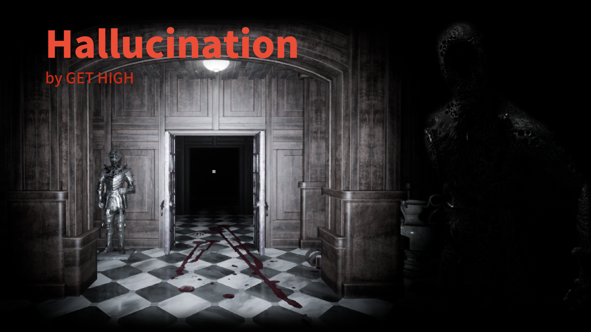
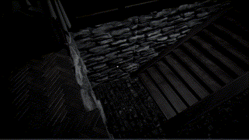
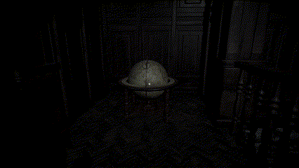
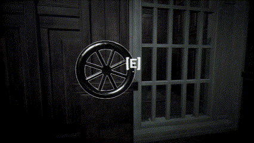

# Hallucination

**_2023, Team Get High Presents_**

## 게임 소개
> _**시놉시스**_  
급작스레 쏟아지는 비.  
남자는 비를 피해 버려진 저택으로 쫒기듯 숨었다.  
...그러지 않은 것이 좋았을텐데 말이다.  
괴물을 피해 저택 밖으로 탈출하라!

Hallucination은 괴물을 피해 저택에서 탈출하는 호러 스텔스 게임입니다. 저택에는 눈이 멀었지만 귀와 코가 아주 예민한 괴물이 돌아다니고 있습니다. 당신은 괴물을 유인하거나, '특별한 능력'을 사용해서 저택의 퍼즐들을 풀어나가야 합니다. 행운을 빕니다.

- Midterm Trailer  

- Final Trailer  

_@2023-2, Prof. H. Kang, KHU Department of Software Convergence, SWCON212 Game Engine Basics_

# Download
Hallucination은 Windows 환경만을 지원합니다.
## [Windows]()   
[다운로드]()
> 1. zip 파일 다운로드 후 압축 해제
> 1. Hallucination.exe 실행

# How To Play

## 조작
* WASD: 이동
* Shift: 달리기
* E: 상호작용(벨브 돌리기, 레버 작동, 문 열기, 아이템 획득 등)
* 좌클릭: 물체 들기 or 밀고 당기기
  * 물체 들기  
  
    * 물체 들고 있는 상태에서 좌클릭: 물체 놓기
    * 물체 들고 있는 상태에서 우클릭: 물체 조준, 다시 클릭하면 던지기
  * 밀고 당기기  
  
    * 물체 잡은 상태에서 앞/뒤로 이동하여 물체 밀고 당기기
* C(능력 획득 필요): 플레이어 중력 반전
* R(능력 획득 필요): 사물 중력 반전

## 퍼즐
* 벨브  

  * 끝까지 돌려야 잠겨있는 문을 열 수 있습니다.
  * 돌리는 내내 큰 소리를 발생시키니 주의하세요!
  * 손잡이가 빠져있는 경우 어딘가에 놓인 손잡이를 E로 습득한 후 벨브 실린더와 상호작용 하면 손잡이를 장착할 수 있습니다.

* 레버  

   * 잠긴 문을 열거나, 열려있는 문을 잠글 수 있습니다.
   * 잠긴 문은 괴물이라고 해도 열기 힘들걸요?
   * 손잡이가 없는 레버가 발견되기도 합니다. 벨브의 경우와 같이 손잡이를 찾아서 상호작용 하세요.

* 스위치 & 동상  

  * 감압식 스위치입니다. 동상을 올려두면 스위치가 작동하여 문이 열립니다.
  * 때론 두 개 이상의 스위치를 작동시켜야 문이 열리기도 합니다.

# 스테이지 구성
1. 인트로 & 튜토리얼
1. Stage1
1. Stage2
1. Stage ???
1. 엔딩

# About Us
* [**서범준**](https://github.com/Seo-BJ)  
_팀장, Enemy, 총괄 디렉팅, Stage1 & Enemy-1, 사운드_

* [**하재준**](https://github.com/How0515)  
_팀원, Enemy, Stage2 & Enemy-2, 범용 AI 길찾기, Stage??? 제작_

* [**박지인**](https://github.com/nagi0101)  

_팀원, Player, Dynamic Gravity, Post Process(player camera), Save System, Packaging_

> 철학과에서 소프트웨어융합학과 게임트랙을 다전공 하고 있는 낭만파 개발자. 컴퓨터 그래픽스에 관심이 많다.

* [**최홍송**](https://github.com/bubbletok)  
_팀원, Player, Interaction, UI, Packaging_

* [**김정훈**](https://github.com/q910389942)  
_팀원, World, 에셋 탐색, 월드 디자인_

* [**문호성**](https://github.com/sim2han)  
_팀원, World, 레벨 디자인, 월드 디자인, 엔딩 제작_

# License
Hallucination is licensed under the MIT License. See [LICENSE.txt](./LICENSE.txt) for detail.