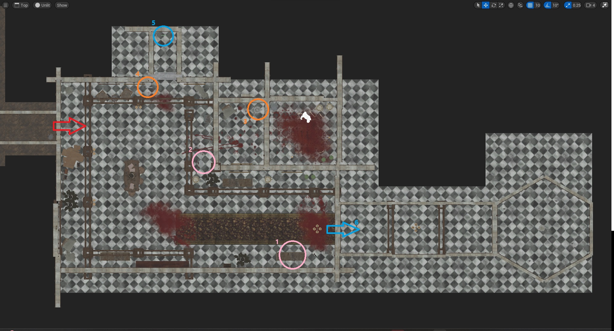
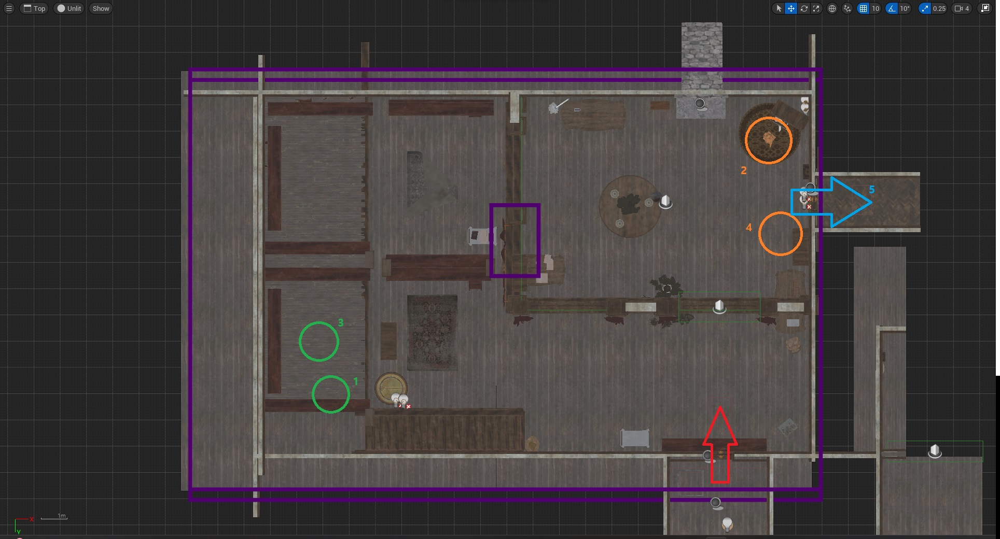

# Stage-1

  

진입점: 빨간색 화살표  

1. 서랍장에 있는 레버 손잡이를 E키를 눌러 습득한다. 이 때 서랍장 왼쪽에 놓인 손전등도 꼭 챙기자.
1. 레버 손잡이를 레버 받침대에 E를 눌러 끼운다. 
1. 괴물이 있는 방의 문을 열고 뒤로 이동한 후 잠시 기다린다. 시계가 울리는 소리가 들리면 괴물이 다른 곳으로 이동하는데, 그 때 방 안에 있는 벨브 손잡이를 E를 눌러 습득한다. 습득 후 주변의 아무 병이나 클릭해서 집은 후 우클릭하여 병을 적이 있던 방 안에 던져 넣는다. 그러면 괴물이 소리를 듣고 방 안으로 들어오게 되는데, 이 때 문을 닫고 위에서 설치했던 레버 손잡이를 E를 눌러 방 문을 잠가 괴물이 밖으로 나오지 못하도록 한다.
1. 괴물이 방을 나오지 못하는 것을 확인했다면(문을 계속 두드림) 벨브 손잡이를 벨브 실린더에 끼우고 벨브를 끝까지 돌려 문을 연다.
1. 열린 문 너머에 있는 열쇠를 E를 눌러 습득한다.
1. 이제 잠긴 문을 열고 다음 스테이지로 이동할 수 있다.

# Stage-2

  

진입점: 빨간색 화살표(천장)

1. C를 눌러 바닥으로 이동 후 바닥에 있는 동상을 잡는다. 계단쪽으로 나와 C를 눌러 다시 바닥면으로 이동하고, 그림의 3번 동그라미에 있는 스위치 근처에 동상을 배치한다. 이 때 동상을 스위치에 올려두면 괴물이 등장하기 때문에 동상이 스위치를 작동시키지 않도록 주의한다.
1. 그림의 주황색 2번 동그라미 위치의 바닥면에 있는 동상의 중력을 반전시켜 천장으로 보낸 뒤 C를 눌러 따라 올라간다. 1번과 같이 동상을 4번 주황색 동그라미 천장면에 있는 스위치 근처에 배치한다. 스위치가 작동되지 않도록 주의한다.
1. 마음의 준비 후 주황색 스위치 근처에 둔 동상을 스위치 위에 올린다. 긴장감 있는 BGM이 재생되며 적이 등장한다. 이 적은 후각을 사용해 당신이 멀리 있어도 당신을 계속해서 쫒아가기 때문에 지금부터는 속도가 중요하다. 빠르게 다른 스위치로 이동한다.
1. 근처에 둔 동상을 스위치 위에 빠르게 올려둔다. 그러면 그림에서 파란색 화살표로 표시한 문이 열린다.
1. 계속해서 쫒아오는 적을 피해 그림에서 파란색 화살표로 표시한 문으로 나간다.